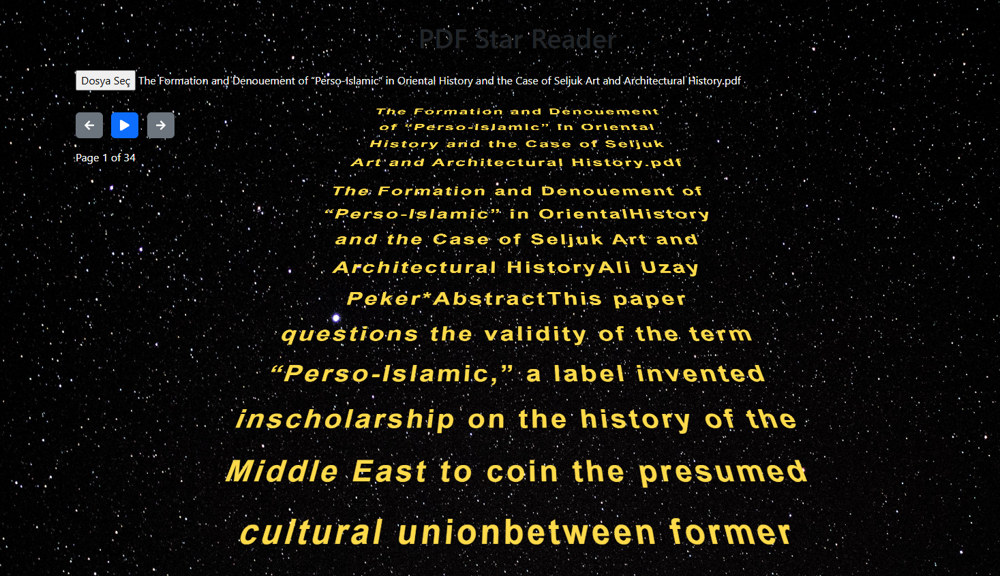

# ⭐ PDF Star Reader

A modern, stylish PDF reader web app with a Star Wars-inspired scrolling animation! Easily view, navigate, and read PDF files directly in your browser.

---

## 🚀 Features

- 📄 Open and read PDF files in your browser
- ⏩ Star Wars-style animated text crawl for PDF content
- ⬅️➡️ Navigate between pages
- 🔢 Jump to any page
- 🎨 Responsive and beautiful UI (Bootstrap 5 & Font Awesome)

---

## 🖼️ Example Screenshot



---

## 🛠️ Getting Started

1. **Clone or Download** this repository.
2. Open `index.html` in your browser.
3. Click the file input to select a PDF file and start reading!

---

## 📂 Project Structure

```
index.html      # Main HTML file
index.js        # JavaScript logic for PDF reading and animation
style.css       # Custom styles
ss1.png         # Example screenshot
LICENSE         # MIT License
```

---

## 📦 Built With

- [Bootstrap 5](https://getbootstrap.com/)
- [Font Awesome](https://fontawesome.com/)
- [PDF.js](https://mozilla.github.io/pdf.js/)

---

## 📜 License

This project is licensed under the MIT License. See the [LICENSE](LICENSE) file for details.

---

Enjoy reading your PDFs in style! 🌟
